# 🛡️ CyberEdu LMS — Açık ve Uzaktan Öğrenme Siber Güvenlik Platformu

Modern, oyunlaştırılmış ve yapay zeka destekli siber güvenlik uzaktan eğitim platformu. Üniversite, kurum veya bireysel eğitimler için hem genel siber farkındalık hem de ileri teknik zafiyet laboratuvarları sunar.


---

## 📑 İçindekiler
1. [Proje Hakkında](#-proje-hakkında)
2. [Temel Teknolojiler](#-temel-teknolojiler)
3. [Kullanıcı Rolleri & Mimari](#-kullanıcı-rolleri--mimari)
4. [📸 Platform Ekran Görüntüleri](#-platform-ekran-görüntüleri)
   - [Öğrenci Arayüzleri](#1-öğrenci-paneli-ekran-görüntüleri)
   - [Öğretmen Arayüzleri](#2-öğretmen-paneli-ekran-görüntüleri)
   - [Yönetici Arayüzü](#3-yönetici-admin-paneli-ekran-görüntüsü)
5. [Öğrenci Özellikleri](#-öğrenci-özellikleri)
6. [Oyunlaştırma & Karakter Koleksiyonu](#-oyunlaştırma--karakter-koleksiyonu)
7. [Yapay Zeka (AI) Entegrasyonu](#-yapay-zeka-ai-entegrasyonu)
8. [👨‍🏫 Öğretmen / Eğitmen Özellikleri](#-öğretmen--eğitmen-özellikleri)
9. [👑 Yönetici (Admin) Özellikleri](#-yönetici-admin-özellikleri)
10. [🗄️ Veritabanı Şeması & Migrasyonlar](#-veritabanı-şeması--migrasyonlar)
11. [🛠️ Kurulum & Çalıştırma](#-kurulum--çalıştırma)
12. [🌐 Canlıya Alma (Vercel Deployment)](#-canlıya-alma-vercel-deployment)

---

## 🚀 Proje Hakkında

**CyberEdu LMS**, öğrencilerin siber güvenlik bilgi ve yeteneklerini iki farklı uzmanlık hattında (Farkındalık ve Teknik Parkur) geliştirmelerini sağlayan açık ve uzaktan öğrenme yönetim sistemidir. Platform; teorik anlatımları interaktif etkinlikler, oyunlaştırma dinamikleri (XP, unvanlar, açılabilir avatarlar) ve gerçek zamanlı bir yapay zeka asistanı ile harmanlayarak yüksek motivasyonlu bir öğrenme deneyimi sunar.

---

## 🛠️ Temel Teknolojiler

- **Frontend:** React 18 (Vite tabanlı), React Router DOM v6
- **Stil & Tasarım:** Tailwind CSS, Özel Siber Neon Koyu Tema (Cyberpunk / Modern Dark UI), Glassmorphism efektleri
- **İkonlar & Animasyonlar:** Lucide React, Framer Motion
- **Backend / Veritabanı:** Supabase (PostgreSQL, Row Level Security - RLS Politikaları, Auth)
- **Yapay Zeka (AI):** Google Gemini 1.5 Flash / Flash Lite API (Öğrenci Mentorluğu ve Öğretmen İçerik Üretimi)
- **Medya Entegrasyonu:** Özel YouTube Player API kontrolleri (Zaman çubuğu, 10s ileri/geri sarma, tam ekran)

---

## 👥 Kullanıcı Rolleri & Mimari

Sistemde 3 temel kullanıcı rolü bulunur ve her rol kendi yetki sınırları dahilinde çalışır:

1. **Öğrenci (`student`):**
   - Kendi parkurundaki zorunlu dersleri sırayla takip eder.
   - Seçmeli kurslara serbestçe kaydolur.
   - İnteraktif etkinlikleri tamamlar, XP kazanır, karakter ve rozetlerin kilidini açar.
   - AI Mentor'dan ders çalışırken ipucu desteği alır.
2. **Öğretmen (`teacher`):**
   - Yeni kurs ve ders modülleri oluşturur/yayınlar.
   - Soru, eşleştirme, video ve anlatım blokları tasarlar (veya YZ ile otomatik üretir).
   - Öğrencilerin detaylı analizlerini ve **en son tamamladıkları dersleri** anlık olarak izler.
3. **Yönetici (`admin`):**
   - Tüm kullanıcıları, rolleri ve kursları yönetir.
   - Gerektiğinde öğrenci ilerlemelerini sıfırlayabilir.

---

## 📸 Platform Ekran Görüntüleri


### 1. Öğrenci Deneyimi ve Öğrenme Yönetim Modülü

CyberEdu LMS öğrenci arayüzü; siber güvenlik farkındalığı ve teknik uzmanlık alanlarına göre özelleşen dinamik bir pedagojik yapı sunar. Gamification (oyunlaştırma) unsurları, sarmal öğrenme yol haritası, interaktif zafiyet analizleri, yapay zekâ destekli mentorluk ve anlık geri bildirim sistemleriyle öğrencilerin pratik becerilerini kalıcı hale getirir.

---

#### 📊 Öğrenci Kontrol Paneli (Dashboard)
Öğrencinin platformdaki aktif durumunu tek merkezden takip ettiği ana ekrandır[cite: 36]. "Kaldığın Yerden Devam Et" modülü üzerinden en son çalışılan ders tek tıkla açılabilir[cite: 36]. Öğrenme süresi, toplam kazanılan XP puanı ve mevcut kurs tamamlanma oranının yanı sıra aktif derslerin aşamaları ile sınıf geneli Canlı Liderlik Tablosu (Leaderboard) bu ekrandan dinamik olarak izlenir[cite: 36].

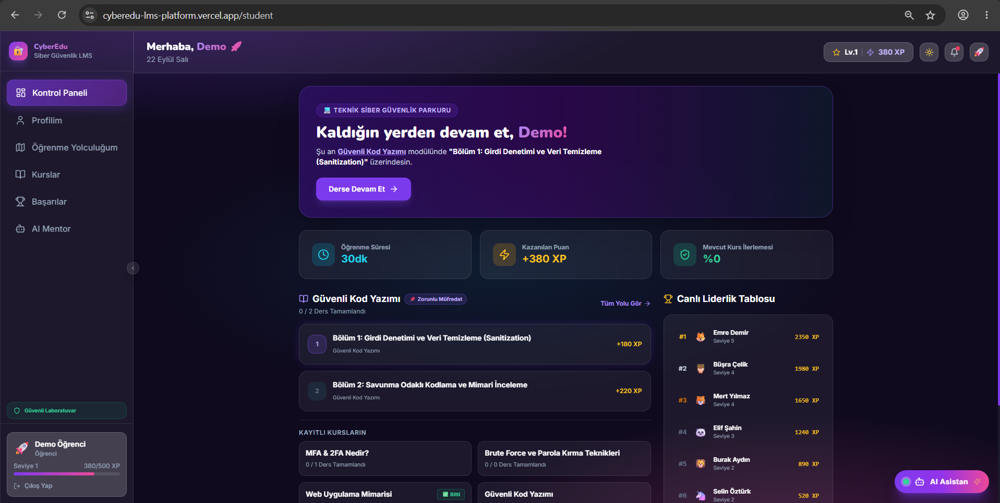

---

#### 🗺️ Öğrenme Yolculuğum (Sarmal Müfredat Haritası)
Yalnızca zorunlu müfredat adımlarını içeren, ön koşullu ve sıralı kilit mekanizmasına sahip sarmal ilerleme rotasıdır[cite: 35]. Öğrenci bir kursu başarıyla tamamlamadan bir sonraki aşamanın kilidi açılmaz[cite: 35]. Tamamlanan kurslar yeşil onay simgesiyle işaretlenir, aktif kurs parlak rota göstergesiyle vurgulanır ve öğrencinin öğrenme disiplini korunur[cite: 35].

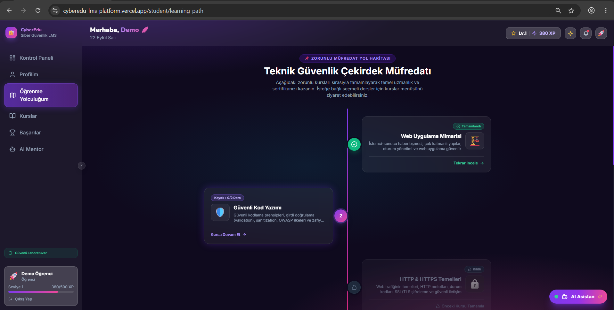

---

#### 📚 Kurslar ve Seçmeli Modül Kataloğu (`/student/courses`)
Öğrencinin kendi ilgi alanına göre keşfedebileceği tüm eğitimlerin yer aldığı modül merkezidir[cite: 34]. Kurslar "Tüm Kurslar", "Seçmeli Kurslar" ve "Zorunlu Müfredat" sekmeleri altında filtrelenebilir[cite: 34]. Öğrenciler zorunlu yol haritasına bağlı kalmaksızın istedikleri seçmeli kurslara (MFA/2FA, Brute Force, Nmap vb.) doğrudan kaydolup bağımsız olarak tamamlayabilirler[cite: 34].

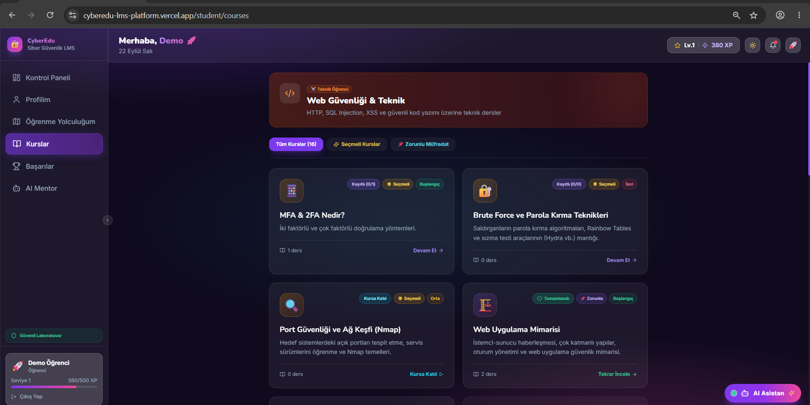

---

#### 🤖 CyberEdu AI Mentor (Kişisel Siber Güvenlik Rehberi)
7/24 kesintisiz rehberlik sunan tam sayfa yapay zekâ çalışma alanıdır[cite: 32]. Öğrenciler OWASP Top 10 zafiyetleri, ağ protokolleri, port güvenlik riskleri veya kariyer adımları gibi önerilen hazır konuları seçebilir ya da doğrudan serbest sorular yöneltebilir[cite: 32]. Model, doğrudan cevap vermek yerine yönlendirici ve Sokratik ipuçlarıyla öğrencinin analitik düşünmesini destekler[cite: 32].

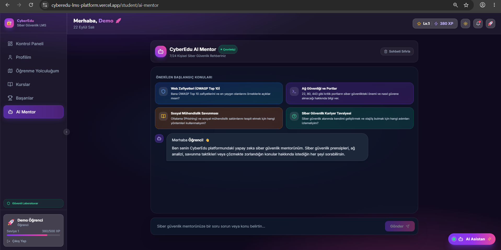

---

#### 💬 Hızlı AI Asistan (Ders İçi Yüzen Sohbet)
Ders çalışma veya etkinlik çözme anında sayfa değiştirmeden sağ alttan tetiklenebilen kompakt asistan penceresidir[cite: 31]. Öğrenci bir soruda takıldığında veya teorik bir kavramı anlamadığında "Bu konuyu basitçe özetle" veya hazır bağlamsal hızlı eylemlerle anında yardım alabilir[cite: 31].

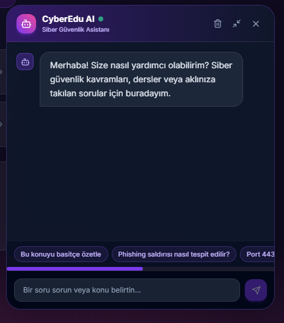

---

#### ✅ Anlık Etkinlik Doğrulama ve Başarı Geri Bildirimi
İnteraktif sorularda (Eşleştirme, D/Y, Çoktan Seçmeli vb.) doğru yanıt verildiğinde devreye giren pozitif pekiştirme katmanıdır[cite: 30]. Öğrenciye anında kazanılan XP ödülü (+50 XP, +80 XP vb.) gösterilir ve teknik çözüm mantığı açıklanarak öğrenme süreci doğrulanır[cite: 30].

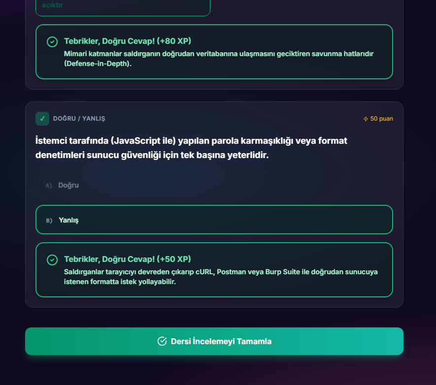

---

#### ❌ Çözüm Açıklamalı Hata Analizi
Yanlış yanıt verildiğinde öğrenciyi cezalandırmak yerine eksik bilgiyi kapatmayı hedefleyen detaylı analiz panelidir[cite: 28]. Sistem doğru eşleşmeleri veya yanıt anahtarını net bir şekilde sergilerken, alt kısımda "Açıklama & Çözüm Mantığı" sunarak kavram yanılgısını anında giderir[cite: 28].

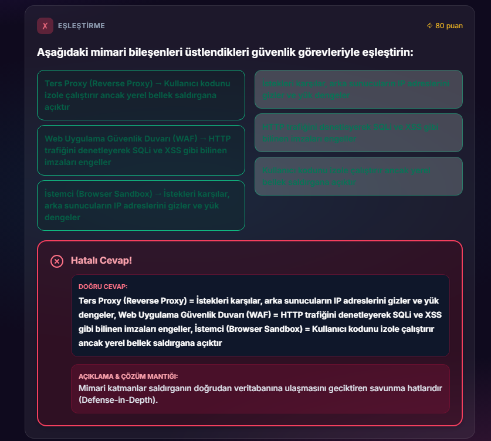

---

#### 🏆 Kurs Bitirme ve Kutlama Ekranı (Greeting Modal)
Bir kurstaki tüm dersler ve interaktif sınavlar başarıyla tamamlandığında açılan ödül penceresidir[cite: 29]. Öğrencinin kurstan kazandığı tüm XP puanlarının hesap bakiyesine aktarıldığını doğrular, motivasyonu artırır ve kullanıcıyı doğrudan rozetler veya yeni kurslar sayfasına yönlendirir[cite: 29].

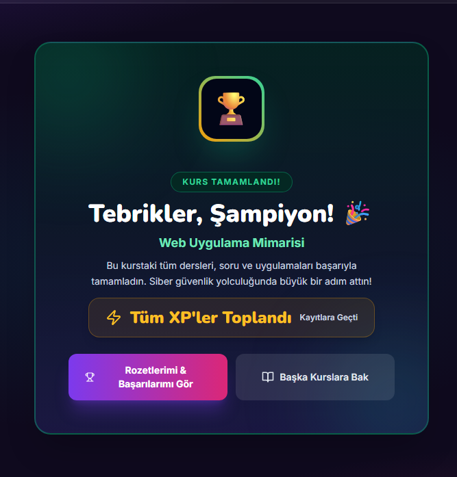

---

#### 🎖️ Başarılar & Karakter Koleksiyonu Odası (`/student/achievements`)
Platformun gamification omurgasını oluşturan vitrindir[cite: 33]. Öğrencinin tamamladığı kurslara göre kazandığı "Kurs Madalyaları", platform görevleriyle açılan "Başarı Rozetleri" ve kademe bazlı "Siber Unvanlar" burada listelenir[cite: 33]. Açılan siber kahraman avatarları (Siber Çırak, Kod Stratejisti, Dijital Kaşif vb.) incelenebilir ve "Karakteri Kuşan" özelliğiyle profil ikonu olarak atanabilir[cite: 33].

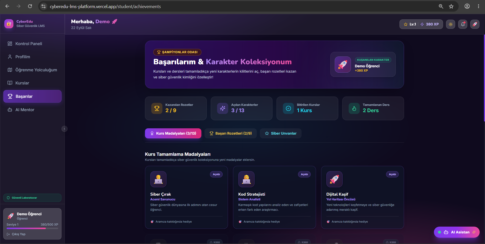

### 2. Eğitmen Modülü ve Yönetim Sistemi

CyberEdu LMS eğitmen modülü; siber güvenlik eğitimlerinin planlanması, modüler ders içeriklerinin hazırlanması, interaktif etkinliklerin kurgulanması, öğrenci başarı metriklerinin gerçek zamanlı izlenmesi ve üretken yapay zekâ entegrasyonuyla içerik geliştirme süreçlerinin hızlandırılmasını sağlayan kapsamlı bir yönetim mimarisi sunar.

---

#### 🏫 Eğitmen Kontrol Paneli (Dashboard)
Platform üzerindeki aktif eğitim süreçlerinin üst düzey izlendiği ana yönetim merkezidir[cite: 30]. Toplam kurs adedi, yayındaki modüller ve sisteme kayıtlı öğrenci sayıları gibi genel metrikleri özetler[cite: 30]. Eğitmenler bu ekrandan doğrudan "Farkındalık Eğitimi" veya "Teknik Zafiyet Kursu" şablonlarını tetikleyebilir ve mevcut kurslarının durumunu inceleyebilir[cite: 30].

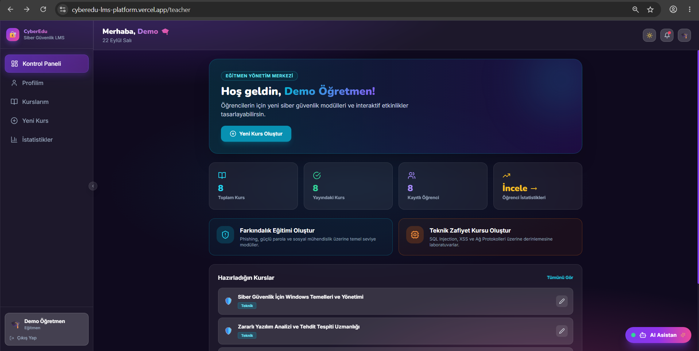

---

#### 📚 Kurs Yönetimi ve Müfredat Listesi (`/teacher/courses`)
Eğitmen tarafından oluşturulan tüm kursların kartlar halinde listelendiği, yayın durumlarının (Yayında / Taslak) ve hedef kitle kategorilerinin (Teknik / Farkındalık) yönetildiği paneldir[cite: 28]. Kurs içeriklerinin önizlenmesi, düzenlenmesi ve yeni eğitim oluşturma süreçleri bu alandan başlatılır[cite: 28].

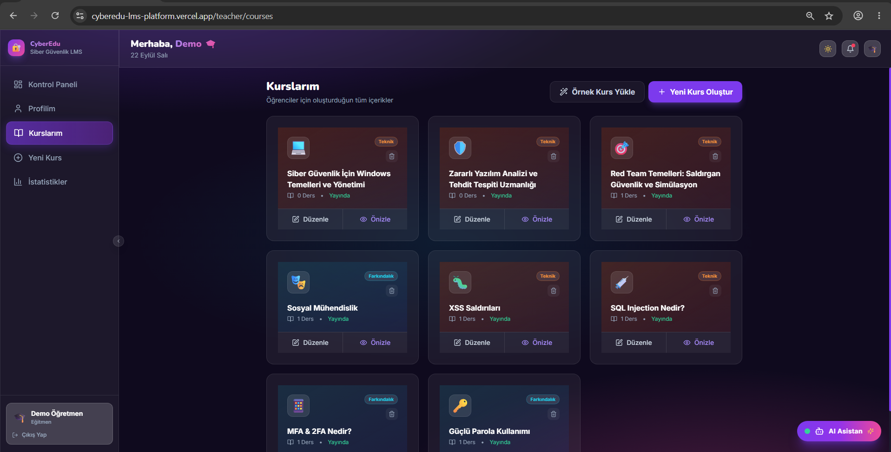

---

#### ➕ Kurs Yapılandırma ve Tanımlama Ekranı (`/teacher/courses/new`)
Yeni bir siber güvenlik modülü oluştururken meta verilerin girildiği form arayüzüdür[cite: 27]. Kurs başlığı, pedagojik açıklama metni, hedef kitle (Farkındalık / Teknik), müfredat türü (Zorunlu / Seçmeli), zorluk derecesi ve temsili görsel emoji bu adımda belirlenir[cite: 27].

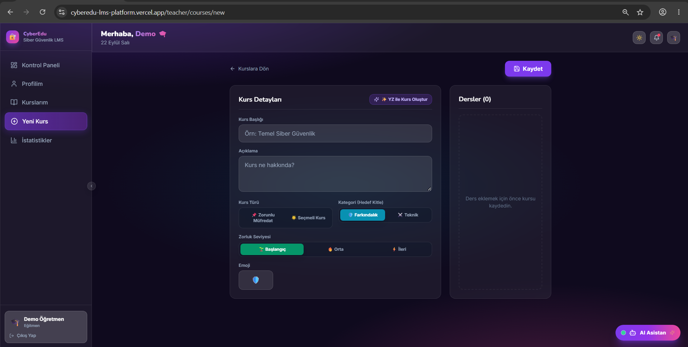

---

#### 🤖 YZ Destekli Kurs Oluşturma Sihirbazı
Eğitim planlama süresini minimuma indirmek amacıyla entegre edilen üretken yapay zekâ özelliğidir[cite: 21, 26]. Üst paneldeki *"✨ YZ ile Kurs Oluştur"* fonksiyonu tetiklendiğinde; girilen konu başlığına uygun detaylı açıklama, zorluk seviyesi, hedef kitle sınıflandırması ve görsel rozet otomatik olarak üretilip forma aktarılır[cite: 21, 26].

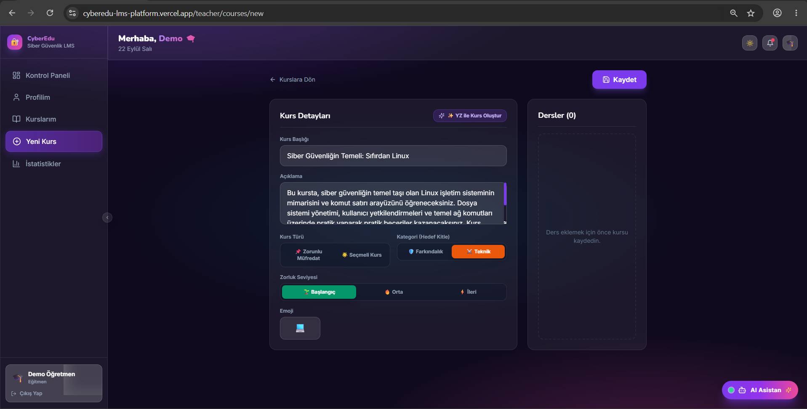

---

#### 🗂️ Kurs Detayı ve Ders Sıralama Yönetimi
Kaydedilen bir kursun genel ayarlarının güncellendiği ve kursa bağlı ders adımlarının kronolojik olarak yönetildiği çalışma alanıdır[cite: 21]. Bu ekrandan kursa yeni dersler eklenebilir, mevcut derslerin yayın durumu değiştirilebilir ve doğrudan içerik düzenleyicisine geçiş yapılabilir[cite: 21].

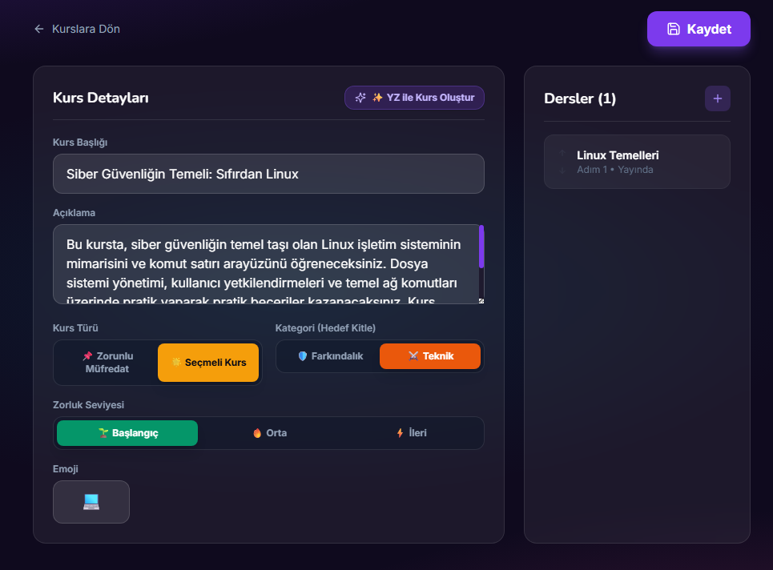

---

#### 🛠️ Modüler Ders & İçerik Düzenleyici (Lesson Builder)
Ders akışının blok tabanlı bir mimariyle kurgulandığı merkezdir[cite: 22]. Teorik anlatımlar, video materyalleri ve interaktif sınavlar sıralı bloklar halinde düzenlenir[cite: 22]. Her blok için bağımsız XP puanı atanabilir, blok sıralamaları değiştirilebilir ve sistemde tanımlı 11 farklı aktivite türü (Çoktan Seçmeli, D/Y, Eşleştirme, Sıralama, Hafıza Kartı, Hotspot, Senaryo vb.) derse dahil edilebilir[cite: 22].

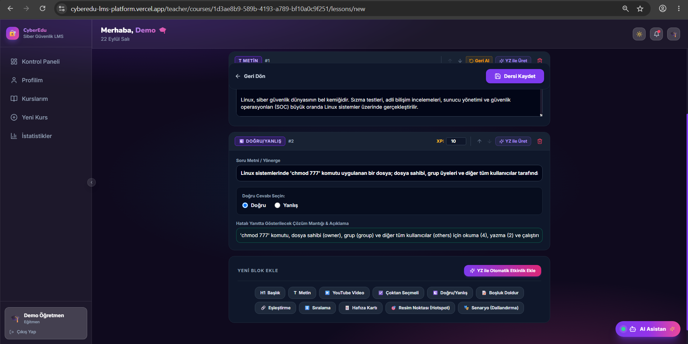

---

#### ✍️ YZ ile Teorik Anlatım & Metin Bloğu Üretimi
Ders içi içerik bloklarında yer alan *"✨ YZ ile Üret"* aracı; eğitmenin belirlediği teknik başlık doğrultusunda pedagojik standartlara ve şablonlara uygun zengin Markdown formatında konu anlatımları türetir[cite: 24, 25].

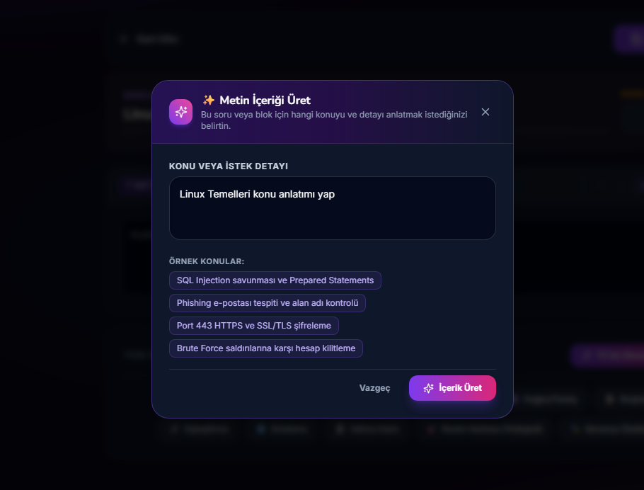

---

#### 🎯 YZ ile Otomatik İnteraktif Etkinlik Üretimi
Ders akışına pratik soru ve değerlendirme adımları eklemek için kullanılan modal arayüzdür[cite: 22, 23]. Eğitmen hedef etkinlik türünü ve konu detayını belirttiğinde, sistem doğrudan doğru cevap anahtarı, seçenekleri, ipuçları ve hata açıklama mantığı tanımlanmış etkinlik objeleri üretir[cite: 23].

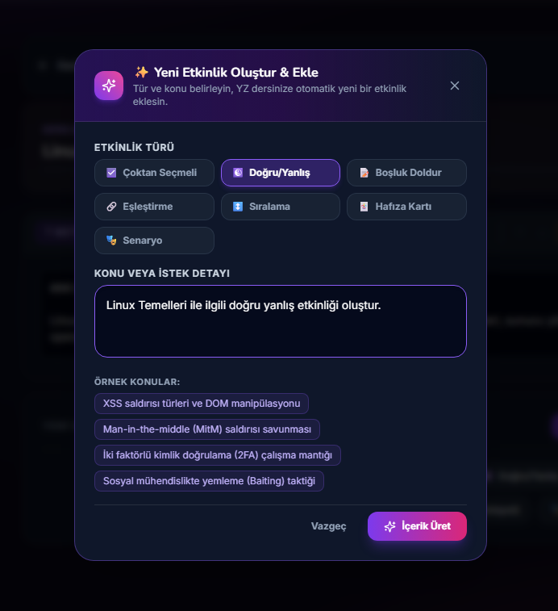

---

#### 📈 Öğrenci İlerleme & Ders İstatistikleri (`/teacher/stats`)
Kayıtlı öğrencilerin eğitim çıktılarını gerçek zamanlı takip eden analitik merkezidir[cite: 32]. Toplam bitirilen ders adedi, ortalama öğrenci XP puanı, aktif katılım yüzdesi gibi makro göstergelerin yanı sıra her öğrencinin parkur türü, en son tamamladığı ders, zaman damgası (*"50 dk önce"* vb.), bitirdiği ders sayısı ve güncel seviyesi bu panel üzerinden izlenebilir[cite: 32].

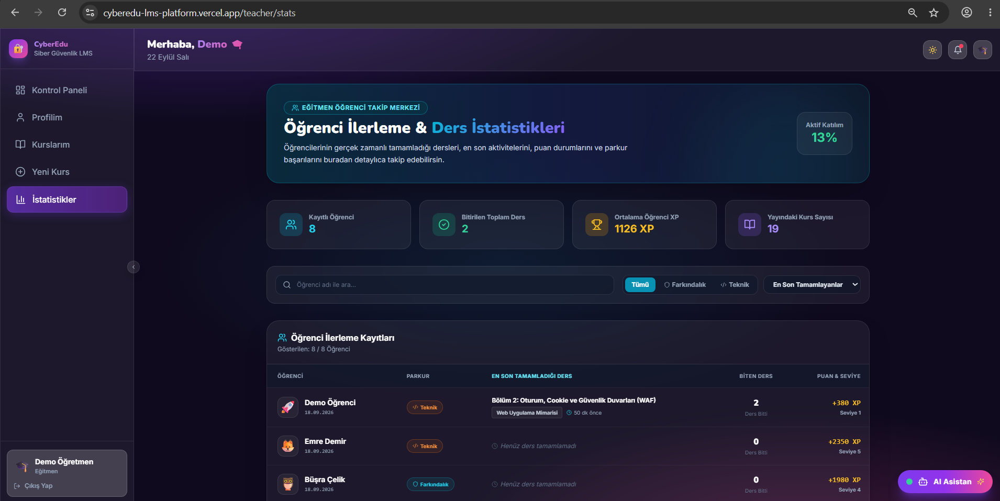

---

#### 👤 Eğitmen Profili ve Hesap Güvenliği (`/teacher/profile`)
Eğitmenin platform üzerindeki kimlik ve yetki parametrelerini düzenlediği ekrandır[cite: 29]. Profil avatar emojisi seçimi, ad-soyad güncellemesi ve parola yenileme gibi hesap güvenliği işlemleri bu merkezden gerçekleştirilir[cite: 29].

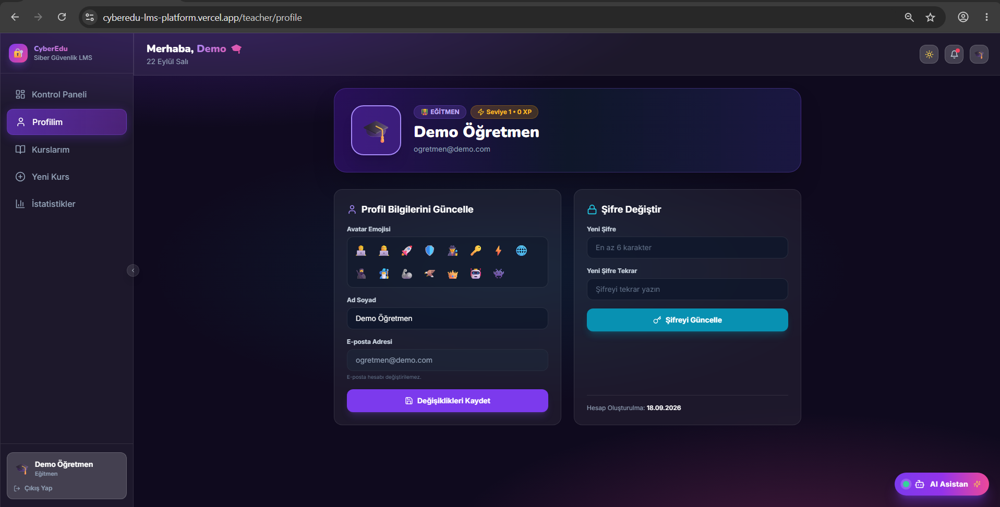

---

### 3. Sistem Yönetim ve Denetim (Admin) Modülü

Platformun rol tabanlı erişim kontrolü (RBAC), veri bütünlüğü ve test süreçlerinin güvenle yürütülmesini sağlayan üst düzey yönetim arayüzüdür[cite: 34].

---

#### ⚙️ Yönetici Kontrol Paneli (`/admin`)
Sistem genelindeki toplam kullanıcı sayısı, kayıtlı kurs hacmi, Row Level Security (RLS) veri güvenliği durumu ve kullanıcıların rol dağılımı (Öğrenci/Eğitmen) bu merkezden izlenir[cite: 34]. Tablo üzerinden kullanıcıların rolleri tek tıkla dinamik olarak değiştirilebilir (Öğrenciyi Eğitmen yapma veya tersi) ve test hesaplarının süreçlerini denetlemek için ilerleme sıfırlama mekanizması tetiklenebilir[cite: 34].

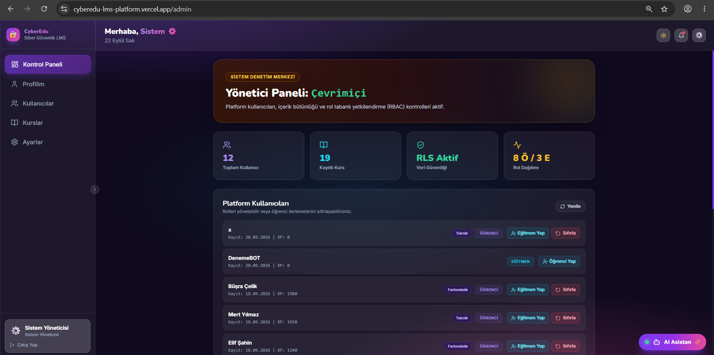

---

#### 🔄 İlerleme Sıfırlama ve İşlem Onay Mekanizması
Yanlışlıkla veri silinmesini önlemek amacıyla çift aşamalı onay (Modal Dialog) mekanizmasıyla korunur[cite: 33]. Bir öğrencinin ilerlemesi sıfırlanmak istendiğinde; tamamlanan dersler, çözülen aktiviteler ve kazanılan XP puanlarının kalıcı olarak silineceğini belirten uyarı ekranı açılır ve yönetici onayı alınır[cite: 33]. Arka planda çalışan `admin_reset_student` RPC fonksiyonu sayesinde ilgili öğrencinin ilerleme tablosundaki kayıtları güvenle temizlenir.

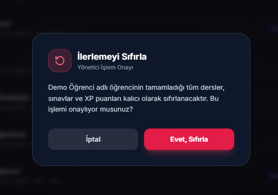
## 🎓 Öğrenci Özellikleri

### 1. Akıllı Oryantasyon (Navigator)
- Yeni kayıt olan öğrenciye özel rehber arayüzü sunulur.
- İlgi alanına göre iki parkurdan birini seçer:
  - 🛡️ **Siber Farkındalık Parkuru:** Günlük dijital güvenlik, phishing, şifre güvenliği, sosyal mühendislik.
  - 💻 **Teknik Güvenlik Parkuru:** HTTP/HTTPS, SQL Injection, XSS, ağ protokolleri, sızma testi temelleri.
- Seviyesini belirler (Başlangıç, Orta, İleri).

### 2. Akıllı Öğrenci Kontrol Paneli (Dashboard)
- **Yeni Öğrenci Karşılama ("🎯 İlk Kursun Hazır!"):** Henüz ders tamamlamamış yeni kayıtlı öğrencilere özel bir karşılama kartı ve ilk dersine tek tıkla başlama butonu sunar.
- **Kaldığın Yerden Devam Etme:** Öğrencinin son çalıştığı veya dersini bitirdiği kursu anlık olarak hafızada tutar ve doğrudan sıradaki dersi önerir.
- **Kurs Tamamlama Kutlaması:** Kursun tüm dersleri bittiğinde tebrik banner'ı çıkar ve sıradaki kursları önerir.
- **Metrik Sayaçları:** Toplam öğrenme süresi (dk/saat), kazanılan toplam XP ve aktif kurs ilerleme yüzdesi.
- **Canlı Liderlik Tablosu:** Tüm öğrenciler arasındaki sıralama ve puan tablosu.

### 3. Öğrenme Yolculuğum (Zorunlu Çekirdek Müfredat)
- Yalnızca **Zorunlu Kursları (`is_mandatory = true`)** içeren sarmal yol haritası.
- Sıralı kilit mantığı: Bir sonraki zorunlu kursa geçebilmek için önceki kursun tüm derslerinin bitirilmesi gerekir.
- Sayfa altında seçmeli kursları keşfetme daveti bulunur.

### 4. Kurslar Kataloğu (Seçmeli & Zorunlu Kurslar)
- Sekmeler: `Tüm Kurslar`, `🌟 Seçmeli Kurslar`, `📌 Zorunlu Müfredat`.
- **Seçmeli Kurs Serbestliği:** Seçmeli kurslarda ön koşul kilidi yoktur (`isLocked = false`). Öğrenci ilgisini çeken seçmeli kursa istediği zaman başlayabilir.
- Her kartta ders sayısı, zorunluk durumu ve zorluk seviyesi gösterilir.

### 5. İnteraktif Ders & Etkinlik Motoru
- **Markdown Destekli Ders İçeriği:** Zengin biçimlendirilmiş metinler ve kod blokları.
- **Çoktan Seçmeli Sorular:** Anlık doğruluk kontrolü ve geri bildirim.
- **Doğru / Yanlış Soruları:** Hızlı pekiştirme soruları.
- **Boşluk Doldurma:** Metin tabanlı etkileşimler.
- **Eşleştirme (Matching):** Kavram ve tanımları eşleştiren interaktif kartlar.
- **Gelişmiş Video Eğitimi:** Özel video ilerleme çubuğu (slider), dakika:saniye sayacı, -10 sn geri sarma, +10 sn ileri sarma, baştan başlatma ve tam ekran izleme.
- **Başarı Eşiği:** Dersin tamamlanabilmesi için interaktif sorulardan en az %80 başarı elde edilmesi gerekir.

---

## 🏆 Oyunlaştırma & Karakter Koleksiyonu

Öğrencilerin eğitimde sürekliliğini sağlamak için çok katmanlı bir ödül sistemi inşa edilmiştir:

### 1. Açılabilir Siber Kahraman Karakterleri (Avatarlar)
Kurslar tamamlandıkça yeni karakterlerin kilitleri açılır:
- `👨‍💻` **Siber Çırak** & `👩‍💻` **Kod Stratejisti** & `🚀` **Dijital Kaşif** *(Başlangıçta açık)*
- `🛡️` **Kalkan Muhafızı** — *Siber Güvenliğe Giriş* kursuyla açılır.
- `🕵️‍♂️` **Siber Dedektif** — *Phishing Nedir?* veya *Sosyal Mühendislik* kursuyla açılır.
- `🔑` **Kripto Hakimi** — *Güçlü Parola Kullanımı* kursuyla açılır.
- `⚡` **İki Aşamalı Bekçi** — *MFA & 2FA Nedir?* kursuyla açılır.
- `🌐` **Protokol Mimarı** — *HTTP & HTTPS Temelleri* kursuyla açılır.
- `🥷` **Veritabanı Ninjası** — *SQL Injection Temelleri* kursuyla açılır.
- `🧙‍♂️` **Kod Büyücüsü** — *XSS Temelleri* kursuyla açılır.
- `🦾` **Siber Gladyatör** — *Brute Force & Parola Güvenliği* kursuyla açılır.
- `🦅` **Ağ Şahini** — *Network & Port Güvenliği* kursuyla açılır.
- `👑` **Siber Lord** — En az 3 kurs bitiren öğrencilere açılır.

### 2. Başarılar / Şampiyonlar Odası (`/student/achievements`)
- **Karakteri Kuşan:** Öğrenci kilidi açılmış herhangi bir karakter kartındaki *"Karakteri Kuşan ✨"* butonuna basarak profil resmini tek tıkla değiştirebilir.
- **Başarı Rozetleri:** *İlk Adım*, *İlk Mezuniyet*, *Oltalama Avcısı*, *XP Avcısı (500+ XP)* gibi kazanılan tüm madalyalar listelenir.
- **Siber Unvanlar:** Öğrencinin tamamladığı uzmanlık konularına göre hak ettiği prestij unvanları.

---

## 🤖 Yapay Zeka (AI) Entegrasyonu

Platformda Google Gemini API ile çalışan iki yönlü yapay zeka gücü bulunur:

1. **Öğrenci AI Mentor (Sağ Altta Sabit Widget):**
   - Her sayfada sağ altta bulunan butona tıklandığında modern bir sohbet penceresi açılır.
   - Sokratik yöntem: Öğrenci bir soruda zorlandığında cevabı doğrudan söylemek yerine düşünmeye teşvik edici ipuçları verir.
   - Siber güvenlik kavramlarını açıklar ve yol gösterir.
2. **Öğretmen İçerik Asistanı (YZ ile Üret):**
   - Kurs ve ders oluştururken öğretmen konu başlığını ve hedefini girer.
   - Yapay zeka saniyeler içinde zengin ders içeriği, çoktan seçmeli sorular ve eşleştirme etkinlikleri üretir.

---

## 👨‍🏫 Öğretmen / Eğitmen Özellikleri

### 1. Eğitmen Kontrol Paneli (`/teacher`)
Eğitmenlerin sisteme giriş yaptığında karşılaştığı ana komuta merkezidir. Öğretmenler bu ekranda toplam kurs sayılarını, yayında olan kurslarını ve platforma kayıtlı toplam öğrenci sayısını anlık metrikler üzerinden takip edebilir. Ayrıca, "Tek Tıkla Şablon Kurslar Yükle" butonu sayesinde yeni eğitmenler örnek müfredatları (Farkındalık ve Teknik parkurlar için) hızlıca kendi hesaplarına klonlayabilirler.

### 2. Kurslarım Sekmesi (`/teacher/courses`)
Öğretmenlerin hazırladıkları tüm kursları listeleyen yönetim sayfasıdır. Bu sayfadan:
- **Yeni Kurs Oluşturma:** Baştan sona yeni bir kurs müfredatı kurgulanabilir.
- **Kurs Durumu:** Hangi kursların yayında olduğu, hangilerinin taslak halinde beklediği görülebilir.
- **Düzenleme ve Silme:** Mevcut kursların içeriklerine saniyeler içinde müdahale edilebilir veya tamamen sistemden kaldırılabilir.

### 3. Kurs Oluşturma & Ders Ekleme (`/teacher/courses/new`)
Eğitmenler esnek ve modern bir arayüz ile kurslarını detaylandırabilir:
- **Kurs Detayları:** Kurs başlığı, açıklaması, zorluk seviyesi (Başlangıç, Orta, İleri), kategorisi (Farkındalık veya Teknik) belirlenir.
- **Zorunlu / Seçmeli Ayrımı:** Kursun, öğrencilerin zorunlu yol haritasında mı çıkacağı, yoksa seçmeli katalogda mı listeleneceği tek bir butonla ayarlanabilir.
- **Ders Sıralaması:** Sürükle bırak benzeri mantıkla derslerin sırası değiştirilebilir ve kilit mekanizmaları ayarlanabilir.

### 4. Görsel Ders İnşa Edici (Lesson Builder) & Etkinlik Motoru
Öğretmenler kod yazmadan, blok tabanlı bir sistemle ders içeriklerini tasarlar. Sisteme eklenebilen etkinlik türleri:
- 📝 **H1 Başlık & Metin (Markdown):** Zengin metin editörüyle konu anlatımı.
- 🎥 **YouTube Video Entegrasyonu:** Zaman etiketleriyle sınırlandırılabilen interaktif video blokları.
- ❓ **Çoktan Seçmeli Sorular:** Şıklar, doğru cevap seçimi ve hata yapıldığında gösterilecek özel açıklamalar.
- 🔘 **Doğru / Yanlış Soruları:** Hızlı test ve pekiştirme etkinlikleri.
- 🔤 **Boşluk Doldurma:** Öğrencinin klavyeyle cevap girdiği interaktif metinler.
- 🧩 **Eşleştirme (Matching):** Kavram ve tanımların sürüklenerek veya seçilerek eşleştirildiği etkinlikler.
- 📍 **Resim Noktası (Hotspot) & Sıralama:** Gelişmiş etkileşim türleri.
- 🌿 **Senaryo (Dallandırma):** Öğrencinin seçimine göre değişen olay örgüleri.

### 5. ✨ Yapay Zeka (AI) Desteği ile Hızlı Üretim
Ders hazırlama sürecini saniyelere indiren yapay zeka modülü, Gemini API ile entegre çalışır:
- **YZ ile Kurs Oluştur:** Sadece "Linux Temelleri" yazarak kursun adını, açıklamasını ve seviyesini otomatik doldurtabilirsiniz.
- **YZ ile Blok (Ders) Üretimi:** Dersin içine "Linux Komutları konu anlatımı yap" veya "Web güvenliği üzerine çoktan seçmeli zor bir soru hazırla" diyerek anında ilgili etkinliği (metin, soru, eşleştirme) oluşturabilirsiniz.

### 6. Öğrenci Analiz & İstatistik Merkezi (`/teacher/stats`)
Sistemdeki tüm öğrencilerin gelişimlerinin izlendiği detaylı analiz sayfasıdır.
- **🎯 En Son Tamamlanan Ders Takibi:** Her öğrencinin en son bitirdiği dersin başlığı, ait olduğu kurs ve zaman damgası (*"10 dk önce"*, *"Bugün"*, *"Dün"*) canlı olarak listelenir.
- **Öğrenci Kartları & İlerleme:** Tamamlanan ders sayısı, toplam XP, seviye ve parkur bilgisi.
- **Filtreleme & Arama:** Öğrenci adına göre anlık arama, parkura göre (`Farkındalık` / `Teknik`) filtreleme ve `En Son Tamamlayanlar` sıralaması.

---

## 👑 Yönetici (Admin) Özellikleri

- **Kullanıcı Yönetimi (`/admin`):** Sistemdeki tüm kullanıcıları listeleme, rolleri (`student`, `teacher`, `admin`) anında değiştirme.
- **Öğrenci İlerlemesini Sıfırlama:** Test süreçleri için öğrencinin XP, seviye ve ders ilerlemelerini güvenli onay penceresiyle sıfırlama.
- **Sistem İstatistikleri:** Platform genelindeki toplam kullanıcı, öğrenci, öğretmen ve kurs metrikleri.

---

## 🗄️ Veritabanı Şeması & Migrasyonlar

Proje veritabanı Supabase üzerinde PostgreSQL ile yapılandırılmıştır. Tüm tablolar Row Level Security (RLS) politikaları ile korunmaktadır.

### Tablolar:
- `profiles`: Kullanıcı profil bilgileri (rol, xp, seviye, avatar_emoji, learning_area).
- `courses`: Kurslar (`is_mandatory`, `course_type`, `category`, `level`, `thumbnail_emoji`).
- `lessons`: Dersler (`course_id`, `title`, `content`, `order_index`, `xp_reward`, `is_published`).
- `activities`: İnteraktif aktiviteler (`lesson_id`, `type`, `question`, `options`, `correct_answer`, `points`).
- `enrollments`: Kurs kayıtları (`user_id`, `course_id`, `status`, `enrolled_at`, `completed_at`).
- `lesson_progress`: Ders tamamlama durumları (`user_id`, `lesson_id`, `status`, `completed_at`, `updated_at`).
- `activity_attempts`: Soru cevaplama ve puan denemeleri.
- `badges` & `user_badges`: Başarı rozetleri ve kazanım kayıtları.

### 🔧 Gerekli SQL Dosyaları (Çalıştırma Sırası):
1. `supabase/migration.sql`: Temel veritabanı şeması ve RLS politikaları.
2. `supabase/add_mandatory_elective_courses.sql`: Zorunlu/seçmeli kurs alanları ve enrollments güncellemesi.
3. `supabase/seed_exact_courses.sql`: Farkındalık ve Teknik standart kurs müfredat verileri.

---

## 🛠️ Kurulum & Çalıştırma

### Yöntem A: Otomatik Kurulum (Bash Script) 🚀
Linux, macOS veya Windows (Git Bash / WSL) üzerinde tek komutla tüm ortamı kurmak ve başlatmak için:

```bash
# Script'e çalıştırma izni verin ve çalıştırın:
chmod +x setup.sh
./setup.sh
```

Bu script:
- Node.js ve npm gereksinimlerini denetler.
- Eksikse `.env.example` dosyasından otomatik `.env` üretir.
- Bağımlılıkları (`npm install`) yükler.
- Supabase SQL adımlarını hatırlatır ve sunucuyu başlatır.

---

### Yöntem B: Manuel Kurulum ⚙️

#### 1. Depoyu Klonlayın
```bash
git clone https://github.com/KadirDuyar/CyberEdu-LMS-Platform.git
cd CyberEdu-LMS-Platform
```

#### 2. Bağımlılıkları Yükleyin
```bash
npm install
```

#### 3. Çevre Değişkenlerini Tanımlayın (`.env`)
Proje kök dizininde bir `.env` dosyası oluşturun (veya `.env.example` dosyasını kopyalayın):
```env
VITE_SUPABASE_URL=https://your-project-id.supabase.co
VITE_SUPABASE_ANON_KEY=eyJhbGciOi...your-anon-key
VITE_GEMINI_API_KEY=AIzaSy...your-gemini-key
```

#### 4. Geliştirme Sunucusunu Başlatın
```bash
npm run dev
```
Uygulama varsayılan olarak `http://localhost:5173` adresinde açılacaktır.

---

## 🌐 Canlıya Alma (Vercel Deployment)

1. Projeyi GitHub reponuza push edin (`git push origin main`).
2. [Vercel Dashboard](https://vercel.com) üzerinden **Add New Project** seçeneğiyle deponuzu bağlayın.
3. **Environment Variables** bölümüne `.env` dosyanızdaki anahtarları ekleyin:
   - `VITE_SUPABASE_URL`
   - `VITE_SUPABASE_ANON_KEY`
   - `VITE_GEMINI_API_KEY`
4. **Deploy** butonuna tıklayın. Vercel projeyi otomatik olarak derleyip yayına alacaktır.

---

## 📄 Lisans
Bu proje eğitim amaçlı açık ve uzaktan öğrenme platformu olarak geliştirilmiştir.
Tüm hakları saklıdır © 2026 CyberEdu LMS.
