# 🛡️ CyberEdu LMS — Öğrenme Yönetim Sistemi Siber Güvenlik Platformu

Modern, oyunlaştırılmış ve yapay zeka destekli siber güvenlik uzaktan eğitim platformu. Üniversite, kurum veya bireysel eğitimler için hem genel siber farkındalık hem de ileri teknik dersler sunar.

### 🌐 Canlı Demo

👉 **[CyberEdu LMS'yi Canlı Gör](https://cyberedu-lms-platform.vercel.app)**

---


---

## 📑 İçindekiler
1. [Proje Hakkında](#-proje-hakkında)
2. [Temel Teknolojiler](#-temel-teknolojiler)
3. [Kullanıcı Rolleri & Mimari](#-kullanıcı-rolleri--mimari)
4. [🎬 Articulate Storyline & SCORM Entegrasyonu](#-articulate-storyline--scorm-entegrasyonu)
5. [📸 Platform Ekran Görüntüleri](#-platform-ekran-görüntüleri)
   - [Öğrenci Arayüzleri](#1-öğrenci-deneyimi-ve-öğrenme-yönetim-modülü)
   - [Eğitmen Arayüzleri](#2-eğitmen-modülü-ve-yönetim-sistemi)
   - [Yönetici Arayüzü](#3-sistem-yönetim-ve-denetim-admin-modülü)
6. [🎓 Öğrenci Özellikleri](#-öğrenci-özellikleri)
7. [🏆 Oyunlaştırma & Karakter Koleksiyonu](#-oyunlaştırma--karakter-koleksiyonu)
8. [🤖 Yapay Zeka (AI) Entegrasyonu](#-yapay-zeka-ai-entegrasyonu)
9. [👨‍🏫 Öğretmen / Eğitmen Özellikleri](#-öğretmen--eğitmen-özellikleri)
10. [👑 Yönetici (Admin) Özellikleri](#-yönetici-admin-özellikleri)
11. [🗄️ Veritabanı Şeması & Migrasyonlar](#-veritabanı-şeması--migrasyonlar)

---

## 🚀 Proje Hakkında

**CyberEdu LMS**, öğrencilerin siber güvenlik bilgi ve yeteneklerini iki farklı alanda (**Farkındalık** ve **Teknik Parkur**) geliştirmelerini amaçlayan açık ve uzaktan öğrenme yönetim sistemidir. Platform; teorik anlatımları interaktif etkinlikler, simülasyonlar, oyunlaştırma bileşenleri (XP, seviye, açılabilir avatarlar) ve yapay zekâ asistanı ile bir araya getirir.

---

## 🛠️ Temel Teknolojiler

- **Frontend:** React 18 (Vite tabanlı), React Router DOM v6
- **Stil & Tasarım:** Tailwind CSS, Koyu Tema (Dark UI), Glassmorphism efektleri
- **İkonlar & Animasyonlar:** Lucide React, Framer Motion
- **Backend / Veritabanı:** Supabase (PostgreSQL, Row Level Security - RLS Politikaları, Auth)
- **Yapay Zeka (AI):** Google Gemini 1.5 Flash / Flash Lite API (Öğrenci Mentorluğu ve Öğretmen İçerik Üretimi)
- **E-Öğrenme Standardı:** Articulate Storyline HTML5 Web & SCORM 1.2 / 2004 postMessage Entegrasyonu
- **Medya Entegrasyonu:** Özel YouTube Player API kontrolleri (Zaman çubuğu, 10s ileri/geri sarma, tam ekran)

---

## 👥 Kullanıcı Rolleri & Mimari

Sistemde 3 temel kullanıcı rolü bulunur ve her rol kendi yetki sınırları dahilinde çalışır:

1. **Öğrenci (`student`):**
   - Kendi parkurundaki zorunlu dersleri sarmal kilit mekanizmasıyla sırayla takip eder.
   - Seçmeli kurslara serbestçe kaydolur ve tamamlar.
   - İnteraktif etkinlikleri çözer, Storyline simülasyonlarını bitirir, XP kazanır, karakter ve rozetlerin kilidini açar.
   - 7/24 AI Mentor'dan ders çalışırken ipucu ve rehberlik desteği alır.
2. **Öğretmen (`teacher`):**
   - Yeni kurs ve modüler ders adımları oluşturur/yayınlar.
   - Soru, eşleştirme, video, Markdown metin ve **Articulate Storyline** blokları tasarlar (veya YZ ile otomatik üretir).
   - Öğrencilerin detaylı analizlerini, haftalık çalışma durumlarını ve **en son tamamladıkları dersleri** canlı izler.
   - Haftalık program modülüyle sınıf gruplarına (cohort) özel öğretim takvimleri kurgular.
3. **Yönetici (`admin`):**
   - Kullanıcıların rollerini (`student`, `teacher`, `admin`) anlık yönetir.
   - Test süreçleri için öğrenci ilerleme verilerini veya kılavuz yönergelerini güvenle sıfırlar.

---

## 🎬 Articulate Storyline & SCORM Entegrasyonu

CyberEdu LMS, **Articulate Storyline 360** HTML5 web çıktılarını ve SCORM paketlerini `StorylinePlayer` bileşeni üzerinden oynatır ve tamamlanma/skor verilerini yakalar:

### 1. `StorylinePlayer` Bileşeni
- **İzleme Modları:**
  - **Inline Mod:** Ders içi içerik akışında 16:9 oranında iframe oynatıcı.
  - **Full Mod:** İçerik tam ekran açıldığında yan gezinme çubuğunu otomatik daraltan görünüm.
- **Tarayıcı Fullscreen API:** Tarayıcı tam ekran desteği.

### 2. Veri İletişimi (postMessage & SCORM Dinleyicisi)
Storyline paketinden gelen tamamlama ve puan sinyalleri `postMessage` dinleyicisi ile karşılanır:
- **Puan / Skor Yakalama:** `TotalScore`, `ScorePoints`, `cmi.core.score.raw` veya `cmi.score.raw` alanları okunur.
- **Oransal XP Hesabı:** Storyline sınav puanı, dersin `xpReward` katsayısıyla oranlanarak hesaplanır (`(puan / maxPuan) * xpReward`).
- **Veritabanı Kaydı:** Tamamlama sinyali alındığında Supabase üzerindeki `lesson_progress` tablosu güncellenir ve öğrenci profiline XP eklenir.
- **Evrensel SCORM & Storyline İletişim Kodu (Generic Bridge):** Aşağıdaki script; projeye özel değişken bağımlılıklarını ortadan kaldırarak hem standart Storyline sınav değişkenlerini (Results.ScorePoints), hem SCORM veri modelini (cmi.core), hem de özel puan değişkenlerini dinamik olarak tespit edecek şekilde genel kullanıma uygun olarak optimize edilmiştir.(özelleştirilebilir)


```javascript
/**
 * CyberEdu LMS - Evrensel Articulate Storyline & SCORM Entegrasyon Köprüsü
 * Bu script, Storyline içindeki tamamlama/skor verisini dinamik olarak okur
 * ve ana LMS penceresine standart bir postMessage ile iletir.
 */
(function sendLmsCompletion() {
  try {
    var player = (typeof GetPlayer === "function") ? GetPlayer() : null;

    // 1. Dinamik Değişken Okuyucu
    function getNumericVar(keys) {
      if (!player) return null;
      for (var i = 0; i < keys.length; i++) {
        try {
          var val = player.GetVar(keys[i]);
          if (val !== undefined && val !== null && val !== "" && !isNaN(Number(val))) {
            return Number(val);
          }
        } catch (e) {}
      }
      return null;
    }

    // 2. Skor Tespiti: Standart Storyline Sınav Değişkenleri ve Özel Alanlar
    var score = getNumericVar([
      "Results.ScorePoints",
      "Results1.ScorePoints",
      "Quiz.ScorePoints",
      "TotalScore",
      "totalScore",
      "Score",
      "Puan"
    ]);

    // 3. Maksimum Puan Tespiti
    var maxScore = getNumericVar([
      "Results.PassPoints",
      "Results.MaxPoints",
      "Results1.MaxPoints",
      "Quiz.MaxPoints",
      "MaxScore",
      "maxScore"
    ]);

    // 4. Standart SCORM API Fallback (Eğer paket SCORM modunda çalışıyorsa)
    if (score === null && typeof window.pipwerks !== "undefined" && window.pipwerks.SCORM) {
      var scormScore = window.pipwerks.SCORM.get("cmi.core.score.raw");
      if (scormScore && !isNaN(Number(scormScore))) {
        score = Number(scormScore);
      }
    }

    // Değer bulunamazsa varsayılan değer atamaları (Yüzdelik sisteme uyumlu)
    var finalScore = (score !== null && score >= 0) ? score : 100;
    var finalMax = (maxScore !== null && maxScore > 0) ? maxScore : 100;

    // 5. Standart LMS Veri Paketi
    var payload = {
      type: "storyline_complete",
      status: "completed",
      score: finalScore,
      maxScore: finalMax,
      percentage: Math.round((finalScore / finalMax) * 100),
      timestamp: new Date().toISOString()
    };

    console.log("[CyberEdu LMS Bridge] Sinyal gönderiliyor:", payload);

    // 6. Güvenli postMessage İletimi
    if (window.parent && window.parent !== window) {
      window.parent.postMessage(JSON.stringify(payload), "*");
    }
  } catch (err) {
    console.error("[CyberEdu LMS Bridge] Entegrasyon hatası:", err);
  }
})();
```

---

## 📸 Platform Ekran Görüntüleri

### 1. Öğrenci Deneyimi ve Öğrenme Yönetim Modülü

CyberEdu LMS öğrenci arayüzü; siber güvenlik farkındalığı ve teknik uzmanlık alanlarına göre özelleşen dinamik bir pedagojik yapı sunar. Gamification (oyunlaştırma) unsurları, sarmal öğrenme yol haritası, interaktif zafiyet analizleri, yapay zekâ destekli mentorluk ve anlık geri bildirim sistemleriyle öğrencilerin pratik becerilerini kalıcı hale getirir.

---

#### 📊 Öğrenci Kontrol Paneli (Dashboard)
Öğrencinin platformdaki aktif durumunu tek merkezden takip ettiği ana ekrandır. "Kaldığın Yerden Devam Et" modülü üzerinden en son çalışılan ders tek tıkla açılabilir. Toplam öğrenme süresi, kazanılan XP, mevcut kurs tamamlama oranları ve sınıf geneli Canlı Liderlik Tablosu bu ekrandan dinamik olarak izlenir.

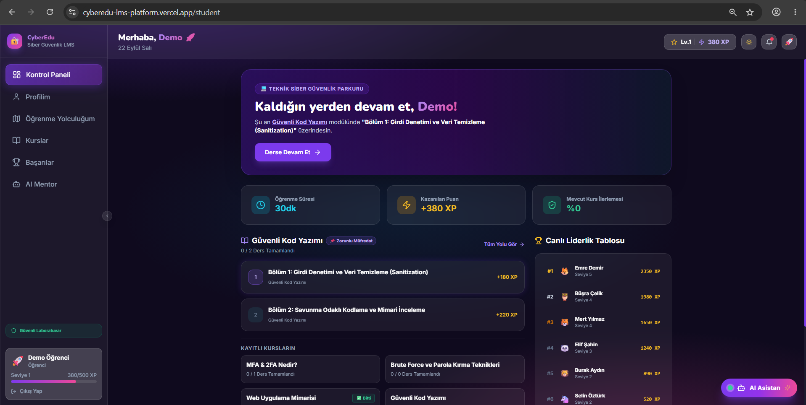

---

#### 🗺️ Öğrenme Yolculuğum (Sarmal Müfredat Haritası)
Yalnızca zorunlu müfredat adımlarını içeren, ön koşullu ve sıralı kilit mekanizmasına sahip sarmal ilerleme rotasıdır. Öğrenci bir kursu başarıyla tamamlamadan bir sonraki aşamanın kilidi açılmaz; tamamlanan modüller yeşil kalkan simgesiyle işaretlenir.

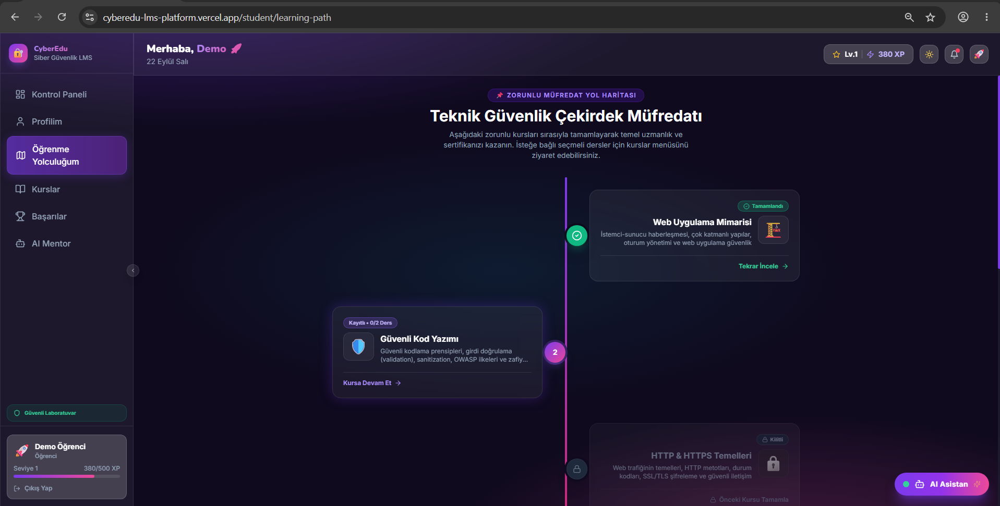

---

#### 📚 Kurslar ve Seçmeli Modül Kataloğu (`/student/courses`)
Öğrencinin kendi ilgi alanına göre keşfedebileceği tüm eğitimlerin yer aldığı modül merkezidir. Kurslar "Tüm Kurslar", "Seçmeli Kurslar" ve "Zorunlu Müfredat" sekmeleri altında filtrelenebilir. Öğrenciler istedikleri seçmeli kurslara doğrudan kaydolup bağımsız olarak tamamlayabilirler.

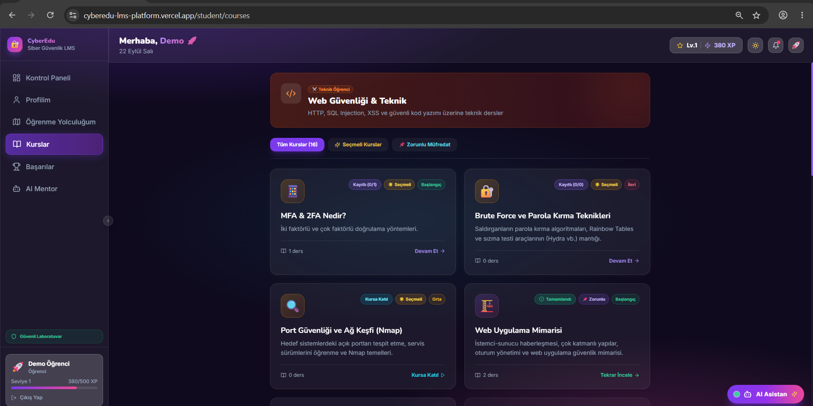

---

#### 📅 Haftalık Sınıf Görevleri & Cohort Programı
Öğrencilerin haftalık bazda takip etmesi gereken dersleri, sınıf görevlerini ve grup çalışmalarını gösteren yapılandırılmış takvim arayüzüdür. Düzenli çalışma alışkanlığı kazandırmak amacıyla modüller haftalık periyotlara bölünmüştür.

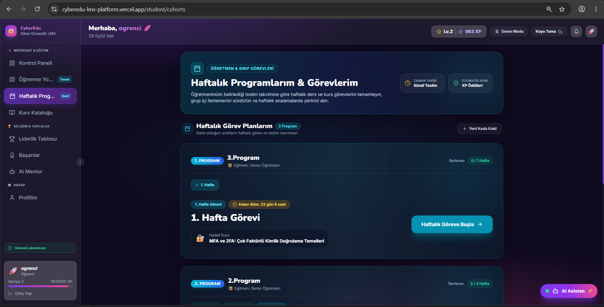

---

#### 🎬 Articulate Storyline & SCORM Etkileşimli Ders Oynatıcı
Storyline HTML5 modüllerinin ve SCORM standartlarındaki zafiyet simülasyonlarının sistem içinde gömülü veya tam ekran çalıştığı alandır. Kullanıcı yanıtları, sınav puanları ve tamamlama durumları gerçek zamanlı yakalanarak öğrenci profiline işlenir.

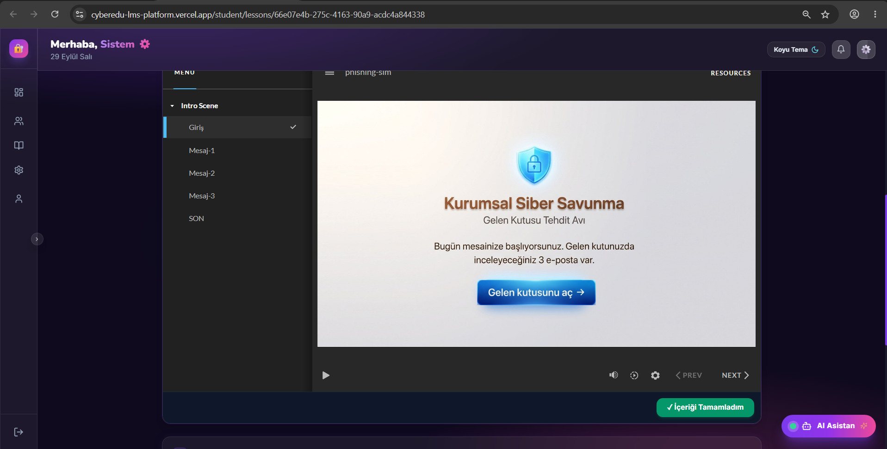

---

#### 🏆 Canlı Liderlik Tablosu & Sosyal Rekabet
Tüm platform genelindeki öğrencilerin XP puanlarına, seviyelerine ve tamamladıkları ders sayılarına göre sıralandığı dinamik rekabet alanıdır. Rozetler, dereceler ve güncel sıralamalar anlık güncellenir.

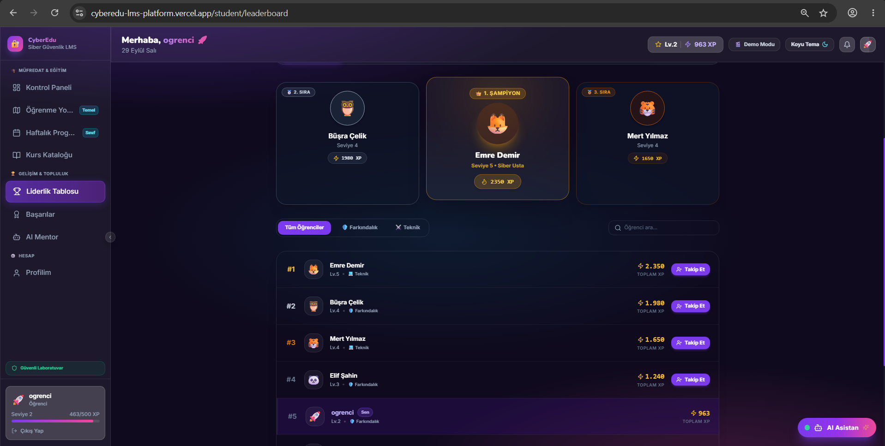

---

#### 🎖️ Başarılar & Karakter Koleksiyonu Odası (`/student/achievements`)
Platformun oyunlaştırma vitrinidir. Öğrencinin tamamladığı kurslara göre kazandığı "Kurs Madalyaları", platform görevleriyle açılan "Başarı Rozetleri" ve 13 farklı açılabilir siber kahraman avatarı burada sergilenir. Açılan karakterler "Karakteri Kuşan" butonuyla profil ikonu olarak atanabilir.

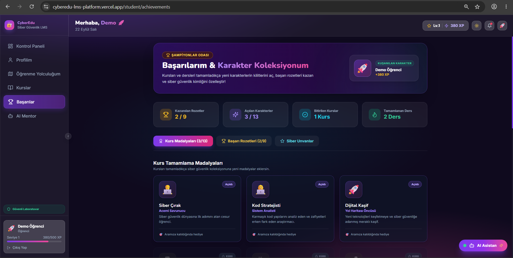

---

#### 🤖 CyberEdu AI Mentor (Kişisel Siber Güvenlik Rehberi)
Google Gemini destekli 7/24 kesintisiz rehberlik sunan akıllı çalışma alanıdır. Öğrenciler OWASP Top 10, ağ güvenliği, parola politikaları gibi konularda sorular sorabilir; asistan doğrudan yanıt yerine Sokratik ipuçlarıyla yönlendirme sağlar.

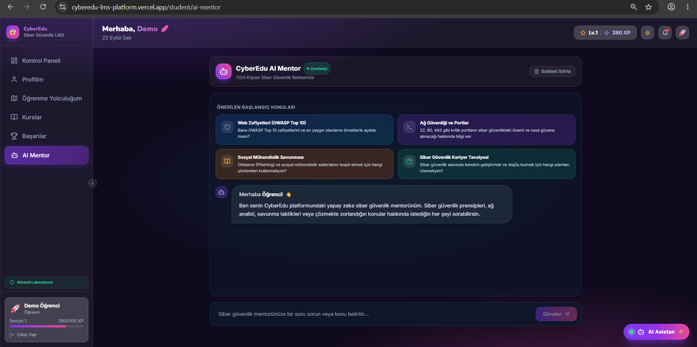

---

### 2. Eğitmen Modülü ve Yönetim Sistemi

CyberEdu LMS eğitmen modülü; siber güvenlik eğitimlerinin planlanması, modüler ders içeriklerinin hazırlanması, interaktif etkinliklerin kurgulanması, haftalık grup programlarının yönetilmesi ve öğrenci başarı metriklerinin gerçek zamanlı izlenmesini sağlar.

---

#### 🏫 Eğitmen Kontrol Paneli (Dashboard)
Platform üzerindeki eğitim süreçlerinin izlendiği ana yönetim merkezidir. Toplam kurs adedi, yayındaki modüller ve sisteme kayıtlı öğrenci sayıları gibi genel göstergeleri özetler; eğitmenler bu ekrandan doğrudan yeni kurs tanımlayabilir veya şablon eğitimleri yükleyebilir.

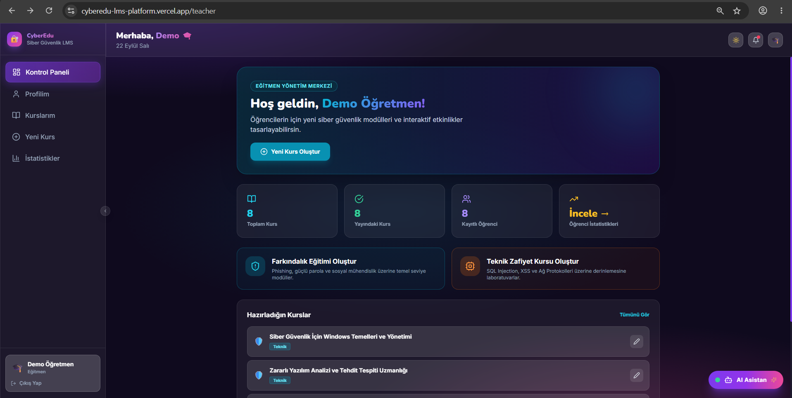

---

#### 📚 Kurs Yönetimi ve Müfredat Listesi (`/teacher/courses`)
Eğitmen tarafından oluşturulan tüm kursların kartlar halinde listelendiği, yayın durumlarının (Yayında / Taslak) ve hedef kitle kategorilerinin (Teknik / Farkındalık) yönetildiği paneldir.

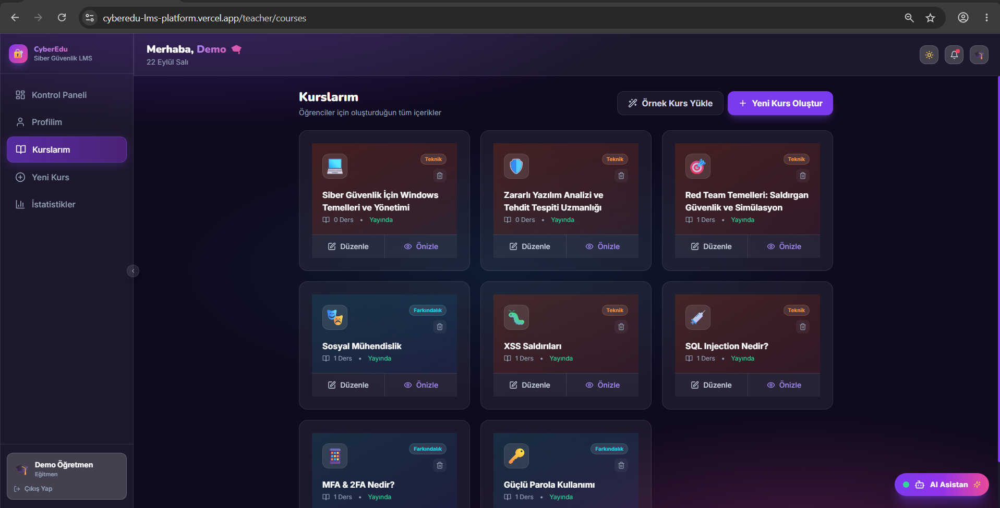

---

#### 🛠️ Modüler Ders & İçerik Düzenleyici (Lesson Builder)
Ders akışının blok tabanlı mimariyle kurgulandığı merkezdir. Markdown anlatımlar, YouTube video blokları, **Articulate Storyline HTML5 paketleri** ve 11 farklı aktivite türü (Çoktan Seçmeli, D/Y, Eşleştirme, Boşluk Doldurma vb.) sıralı olarak yapılandırılır.

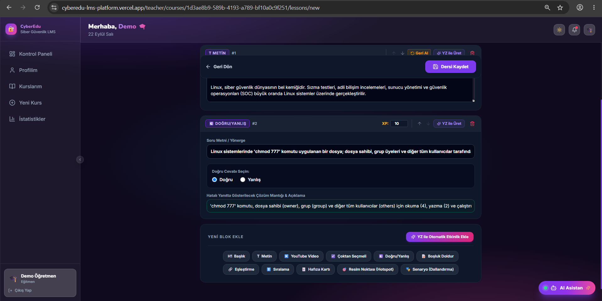

---

#### 📅 Haftalık Sınıf & Program Yönetimi (Cohorts)
Eğitmenlerin sınıf bazlı çalışma grupları (cohort) için haftalık programlar oluşturabildiği, dersleri haftalara atayabildiği ve öğrencilerin haftalık tamamlama durumlarını kontrol edebildiği yönetim ekranıdır.

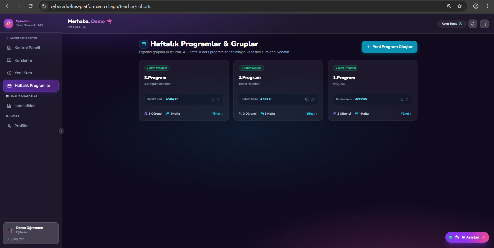

---

#### 📈 Öğrenci İlerleme & Ders İstatistikleri (`/teacher/stats`)
Kayıtlı öğrencilerin eğitim çıktılarını gerçek zamanlı takip eden analitik merkezidir. Her öğrencinin parkur türü, en son tamamladığı ders, zaman damgası (*"50 dk önce"* vb.), bitirdiği ders sayısı ve seviyesi canlı olarak izlenebilir.

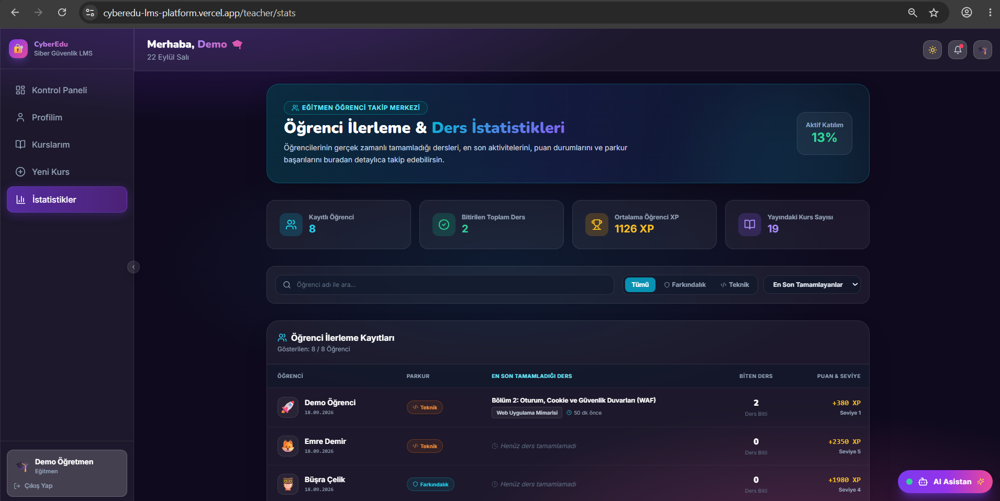

---

#### 👤 Eğitmen Profili ve Hesap Güvenliği (`/teacher/profile`)
Eğitmenin platform üzerindeki kimlik ve yetki parametrelerini düzenlediği ekrandır. Profil avatar emojisi seçimi, ad-soyad güncellemesi ve parola yenileme işlemleri bu ekrandan yürütülür.

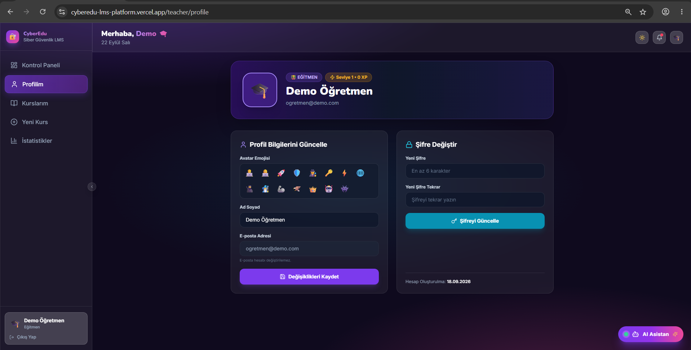

---

### 3. Sistem Yönetim ve Denetim (Admin) Modülü

Platformun rol tabanlı erişim kontrolü (RBAC), veri bütünlüğü ve denetim süreçlerinin güvenle yürütülmesini sağlayan üst düzey yönetim arayüzüdür.

---

#### ⚙️ Yönetici Kontrol Paneli (`/admin`)
Sistem genelindeki toplam kullanıcı sayısı, kayıtlı kurs hacmi, Row Level Security (RLS) veri güvenliği durumu ve kullanıcı rolleri bu merkezden yönetilir. Kullanıcıların rolleri tek tıkla değiştirilebilir (`student`, `teacher`, `admin`) ve test süreçleri için güvenli ilerleme & kılavuz yönergesi sıfırlama mekanizması tetiklenebilir.

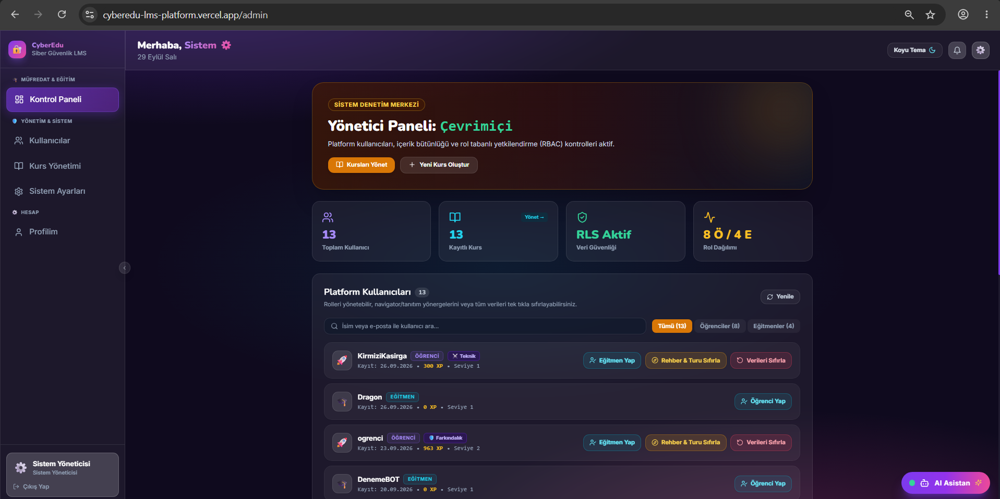

---

## 🎓 Öğrenci Özellikleri

### 1. Akıllı Oryantasyon (Navigator)
- Yeni kayıt olan öğrenciye özel rehber arayüzü sunulur.
- İlgi alanına göre iki parkurdan birini seçer:
  - 🛡️ **Siber Farkındalık Parkuru:** Günlük dijital güvenlik, phishing, şifre güvenliği, sosyal mühendislik.
  - 💻 **Teknik Güvenlik Parkuru:** HTTP/HTTPS, SQL Injection, XSS, ağ protokolleri, sızma testi temelleri.
- Seviyesini belirler (Başlangıç, Orta, İleri).

### 2. Akıllı Öğrenci Kontrol Paneli (Dashboard)
- **Kaldığın Yerden Devam Etme:** Öğrencinin son çalıştığı veya dersini bitirdiği kursu anlık olarak hafızada tutar ve doğrudan sıradaki dersi önerir.
- **Kurs Tamamlama Kutlaması:** Kursun tüm dersleri bittiğinde tebrik banner'ı çıkar ve sıradaki kursları önerir.
- **Metrik Sayaçları:** Toplam öğrenme süresi (dk/saat), kazanılan toplam XP ve aktif kurs ilerleme yüzdesi.
- **Canlı Liderlik Tablosu:** Tüm öğrenciler arasındaki sıralama ve puan tablosu.

### 3. Öğrenme Yolculuğum (Zorunlu Çekirdek Müfredat)
- Yalnızca **Zorunlu Kursları (`is_mandatory = true`)** içeren sarmal yol haritası.
- Sıralı kilit mantığı: Bir sonraki zorunlu kursa geçebilmek için önceki kursun tüm derslerinin bitirilmesi gerekir.
- Sayfa altında seçmeli kursları keşfetme daveti bulunur.

### 4. Kurslar Kataloğu (Seçmeli & Zorunlu Kurslar)
- Sekmeler: `Tüm Kurslar`, `🌟 Seçmeli Kurslar`, `📌 Zorunlu Müfredat`.
- **Seçmeli Kurs Serbestliği:** Seçmeli kurslarda ön koşul kilidi yoktur (`isLocked = false`). Öğrenci ilgisini çeken seçmeli kursa istediği zaman başlayabilir.
- Her kartta ders sayısı, zorunluk durumu ve zorluk seviyesi gösterilir.

### 5. İnteraktif Ders & Etkinlik Motoru
- **Markdown Destekli Ders İçeriği:** Zengin biçimlendirilmiş metinler ve kod blokları.
- **Articulate Storyline & SCORM Simülasyonları:** Gerçek zamanlı puan yakalama ve tamamlama köprüsü.
- **Çoktan Seçmeli Sorular:** Anlık doğruluk kontrolü ve geri bildirim.
- **Doğru / Yanlış Soruları:** Hızlı pekiştirme soruları.
- **Boşluk Doldurma:** Metin tabanlı etkileşimler.
- **Eşleştirme (Matching):** Kavram ve tanımları eşleştiren interaktif kartlar.
- **Gelişmiş Video Eğitimi:** Özel video ilerleme çubuğu (slider), dakika:saniye sayacı, -10 sn geri sarma, +10 sn ileri sarma ve tam ekran izleme.
- **Başarı Eşiği:** Dersin tamamlanabilmesi için interaktif sorulardan en az %50 başarı elde edilmesi gerekir.

---

## 🏆 Oyunlaştırma & Karakter Koleksiyonu

Öğrencilerin eğitimde sürekliliğini sağlamak için çok katmanlı bir ödül sistemi inşa edilmiştir:

### 1. Açılabilir Siber Kahraman Karakterleri (Avatarlar)
Kurslar tamamlandıkça yeni karakterlerin kilitleri açılır:
- `👨‍💻` **Siber Çırak** & `👩‍💻` **Kod Stratejisti** & `🚀` **Dijital Kaşif** *(Başlangıçta açık)*
- `🛡️` **Kalkan Muhafızı** — *Siber Güvenliğe Giriş* kursuyla açılır.
- `🕵️‍♂️` **Siber Dedektif** — *Phishing Nedir?* veya *Sosyal Mühendislik* kursuyla açılır.
- `🔑` **Kripto Hakimi** — *Güçlü Parola Kullanımı* kursuyla açılır.
- `⚡` **İki Aşamalı Bekçi** — *MFA & 2FA Nedir?* kursuyla açılır.
- `🌐` **Protokol Mimarı** — *HTTP & HTTPS Temelleri* kursuyla açılır.
- `🥷` **Veritabanı Ninjası** — *SQL Injection Temelleri* kursuyla açılır.
- `🧙‍♂️` **Kod Büyücüsü** — *XSS Temelleri* kursuyla açılır.
- `🦾` **Siber Gladyatör** — *Brute Force & Parola Güvenliği* kursuyla açılır.
- `🦅` **Ağ Şahini** — *Network & Port Güvenliği* kursuyla açılır.
- `👑` **Siber Lord** — En az 3 kurs bitiren öğrencilere açılır.

### 2. Başarılar / Şampiyonlar Odası (`/student/achievements`)
- **Karakteri Kuşan:** Öğrenci kilidi açılmış herhangi bir karakter kartındaki *"Karakteri Kuşan ✨"* butonuna basarak profil resmini tek tıkla değiştirebilir.
- **Başarı Rozetleri:** *İlk Adım*, *İlk Mezuniyet*, *Oltalama Avcısı*, *XP Avcısı (500+ XP)* gibi kazanılan tüm madalyalar listelenir.
- **Siber Unvanlar:** Öğrencinin tamamladığı uzmanlık konularına göre hak ettiği prestij unvanları.

---

## 🤖 Yapay Zeka (AI) Entegrasyonu

Platformda Google Gemini API ile çalışan iki yönlü yapay zeka gücü bulunur:

1. **Öğrenci AI Mentor (Tam Sayfa & Sohbet):**
   - Sokratik yöntem: Öğrenci bir soruda zorlandığında cevabı doğrudan söylemek yerine düşünmeye teşvik edici ipuçları verir.
   - Siber güvenlik kavramlarını açıklar ve pratik öneriler sunar.
2. **Öğretmen İçerik Asistanı (YZ ile Üret):**
   - Kurs ve ders oluştururken öğretmen konu başlığını ve hedefini girer.
   - Yapay zeka saniyeler içinde zengin ders içeriği, çoktan seçmeli sorular ve eşleştirme etkinlikleri üretir.

---

## 👨‍🏫 Öğretmen / Eğitmen Özellikleri

### 1. Eğitmen Kontrol Paneli (`/teacher`)
Öğretmenler bu ekranda toplam kurs sayılarını, yayında olan kurslarını ve platforma kayıtlı toplam öğrenci sayısını anlık metrikler üzerinden takip edebilir.

### 2. Kurs Yönetimi (`/teacher/courses`)
- **Yeni Kurs Oluşturma:** Baştan sona yeni bir kurs müfredatı kurgulanabilir.
- **Kurs Durumu:** Hangi kursların yayında olduğu, hangilerinin taslak halinde beklediği görülebilir.
- **Zorunlu / Seçmeli Ayrımı:** Kursun, öğrencilerin zorunlu yol haritasında mı çıkacağı, yoksa seçmeli katalogda mı listeleneceği tek tıkla ayarlanabilir.

### 3. Görsel Ders İnşa Edici (Lesson Builder) & Etkinlik Motoru
Öğretmenler kod yazmadan, blok tabanlı bir sistemle ders içeriklerini tasarlar:
- 📝 **Markdown Metin:** Zengin metin editörüyle konu anlatımı.
- 🎬 **Articulate Storyline / SCORM:** Web çıktısı HTML5 URL entegrasyonu ve otomatik XP puanlama.
- 🎥 **YouTube Video Entegrasyonu:** Zaman etiketleriyle sınırlandırılabilen video blokları.
- ❓ **Çoktan Seçmeli & Doğru / Yanlış Soruları:** Şıklar, doğru cevap seçimi ve hata açıklamaları.
- 🔤 **Boşluk Doldurma & Eşleştirme:** İnteraktif uygulama ve pekiştirme kartları.

### 4. Öğrenci Analiz & İstatistik Merkezi (`/teacher/stats`)
- **🎯 En Son Tamamlanan Ders Takibi:** Her öğrencinin en son bitirdiği dersin başlığı, ait olduğu kurs ve zaman damgası (*"10 dk önce"*, *"Bugün"*, *"Dün"*) canlı olarak listelenir.
- **Öğrenci Kartları & İlerleme:** Tamamlanan ders sayısı, toplam XP, seviye ve parkur bilgisi.
- **Filtreleme & Arama:** Öğrenci adına göre anlık arama, parkura göre (`Farkındalık` / `Teknik`) filtreleme.

---

## 👑 Yönetici (Admin) Özellikleri

- **Kullanıcı Yönetimi (`/admin`):** Sistemdeki tüm kullanıcıları listeleme, rolleri (`student`, `teacher`, `admin`) anında değiştirme.
- **Öğrenci İlerlemesini & Yönergeleri Sıfırlama:** Test süreçleri için öğrencinin XP, seviye, ders ilerlemeleri veya oryantasyon/site tanıtım kılavuzlarını güvenli onay penceresiyle sıfırlama.
- **Sistem İstatistikleri:** Platform genelindeki toplam kullanıcı, öğrenci, öğretmen ve kurs metrikleri.

---

## 🗄️ Veritabanı Şeması & Migrasyonlar

Proje veritabanı Supabase üzerinde PostgreSQL ile yapılandırılmıştır. Tüm tablolar Row Level Security (RLS) politikaları ile korunmaktadır.

### Tablolar:
- `profiles`: Kullanıcı profil bilgileri (rol, xp, seviye, avatar_emoji, learning_area).
- `courses`: Kurslar (`is_mandatory`, `course_type`, `category`, `level`, `thumbnail_emoji`).
- `lessons`: Dersler (`course_id`, `title`, `content`, `order_index`, `xp_reward`, `is_published`).
- `activities`: İnteraktif aktiviteler (`lesson_id`, `type`, `question`, `options`, `correct_answer`, `points`).
- `enrollments`: Kurs kayıtları (`user_id`, `course_id`, `status`, `enrolled_at`, `completed_at`).
- `lesson_progress`: Ders tamamlama durumları (`user_id`, `lesson_id`, `status`, `completed_at`, `updated_at`).
- `cohort_schedules`: Haftalık sınıf görevleri ve program takvimi.
- `badges` & `user_badges`: Başarı rozetleri ve kazanım kayıtları.

---

## 📄 Lisans
Bu proje eğitim amaçlı açık ve uzaktan öğrenme platformu olarak geliştirilmiştir.  
Tüm hakları saklıdır © 2026 CyberEdu LMS.
